

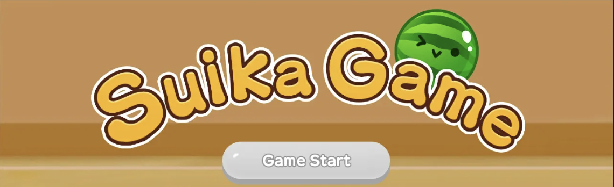

# 🍉 Suika Game

A recreation of the classic **Suika (Watermelon) Game**, built in Unity and playable right in your browser.
Drop fruits, merge matching pairs, and grow them all the way up to a watermelon — without overflowing the box!

---

## 📸 Gameplay

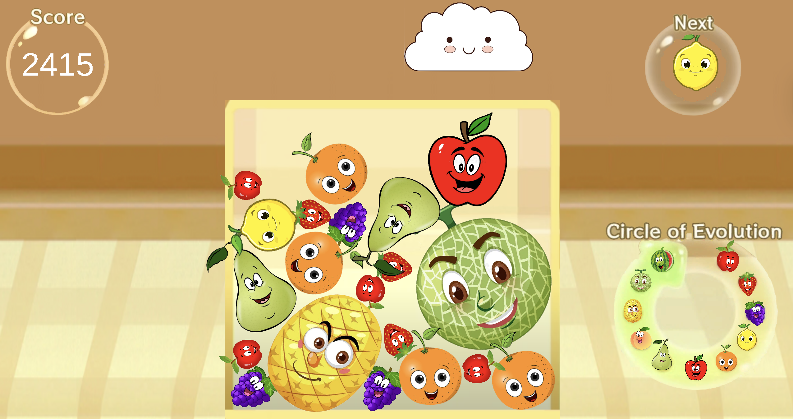

## 🎮 How to Play

| Action | Control |
| --- | --- |
| Move the dropper | **A / D** |
| Drop a fruit | **Left click** |
| Goal | Merge two of the same fruit to evolve it into the next one |
| Game over | A fruit settles above the top of the container |

> 💡 You can only drop one fruit at a time — the next drop unlocks once the last fruit has landed.

## 🍒 Fruit Evolution Chain

Match two identical fruits and they merge into the next one up the chain:

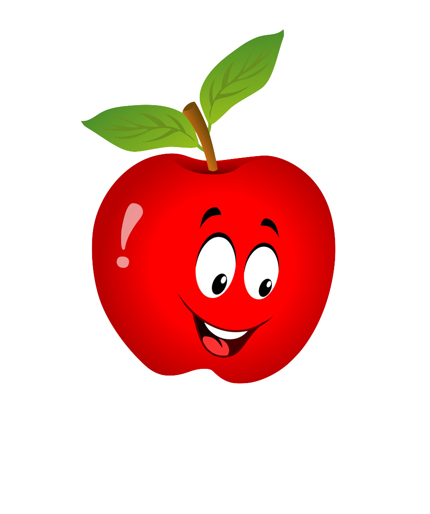 ➜
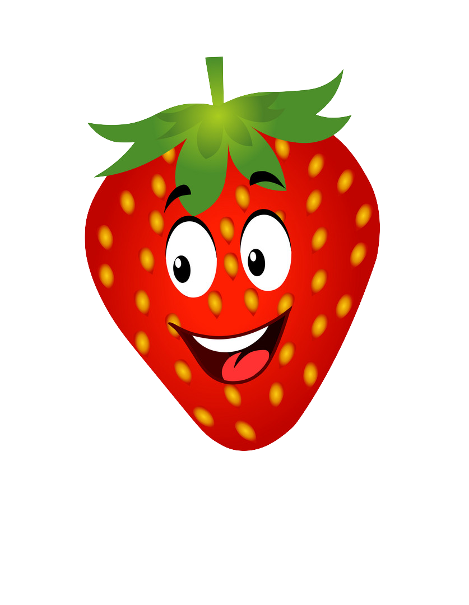 ➜
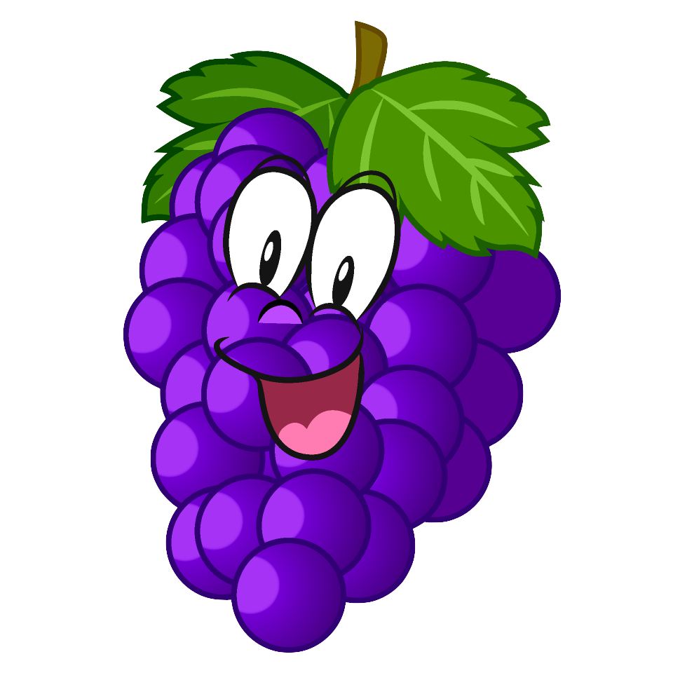 ➜
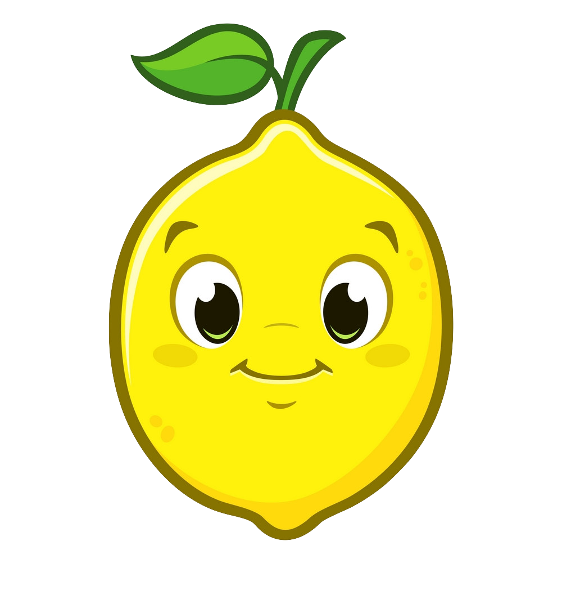 ➜
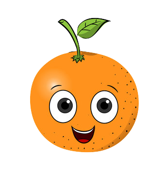 ➜
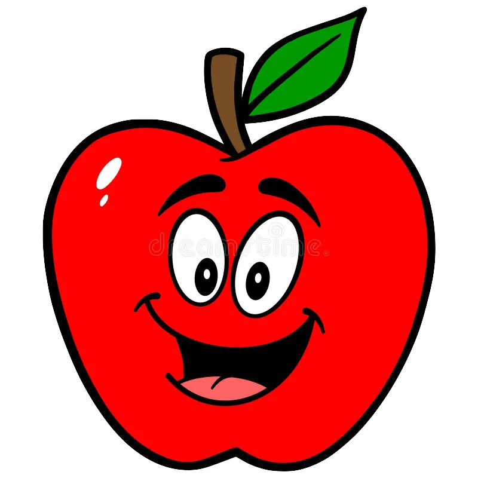 ➜
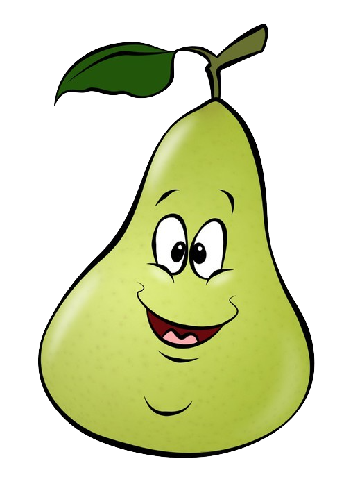 ➜
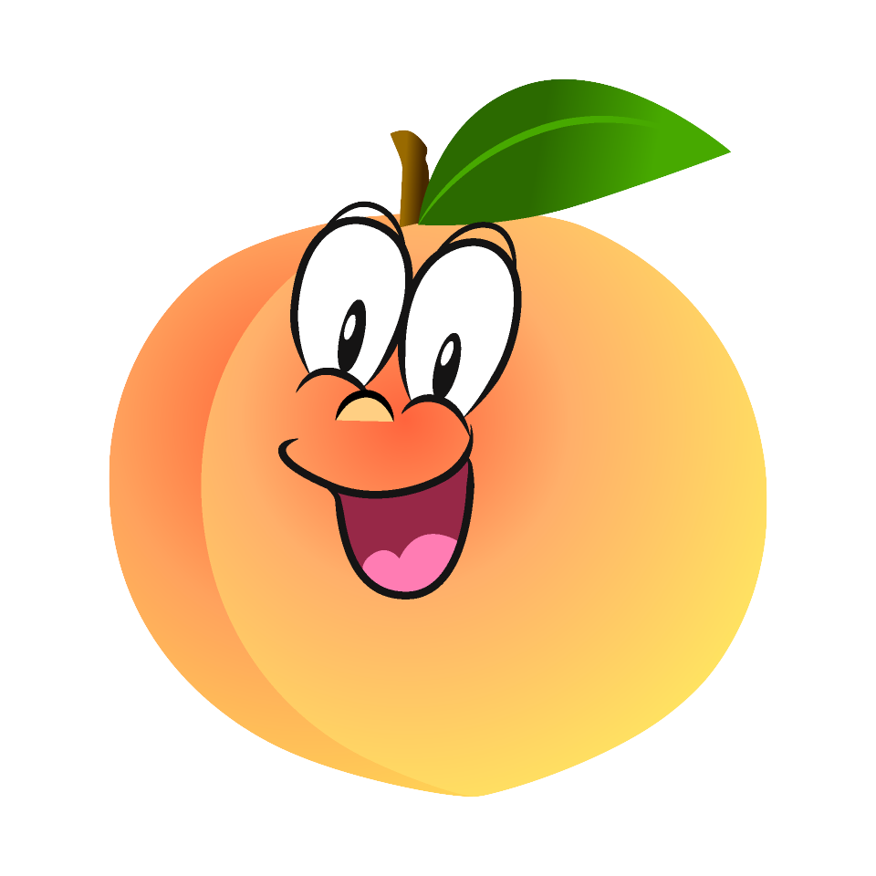 ➜
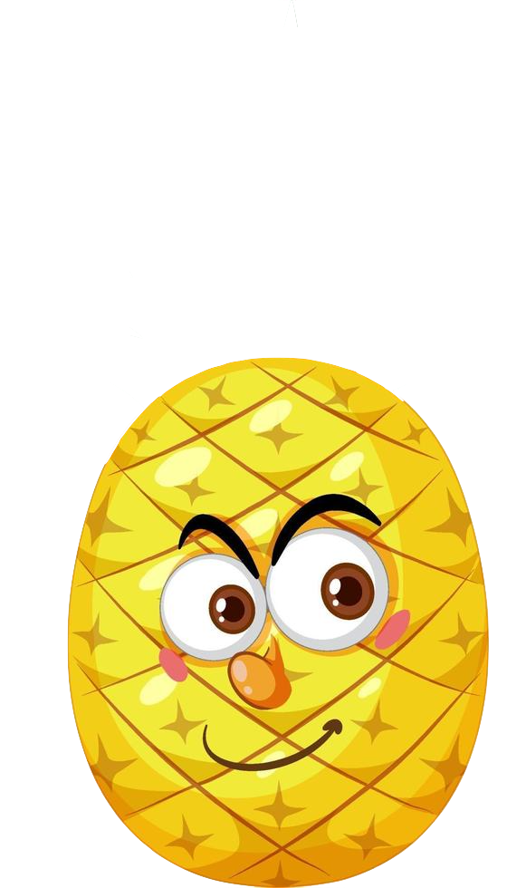 ➜
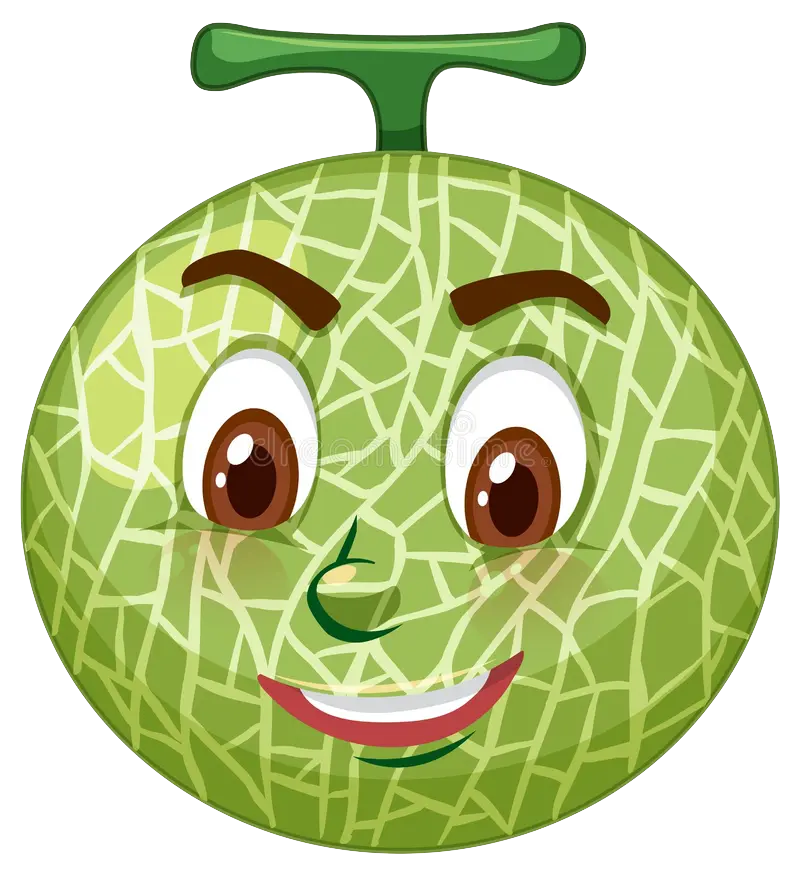 ➜
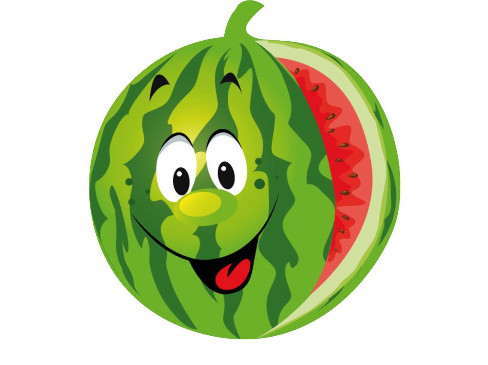

**Cherry → Strawberry → Grapes → Dekopon → Orange → Apple → Pear → Peach → Pineapple → Melon → 🍉 Watermelon**

## 🛠️ Built With

- **Unity** (2022.3) — game engine & 2D physics
- **C#** — gameplay scripting
- **WebGL** — browser build target
- **GitHub Pages** — hosting

## 🚀 Run It Yourself

1. Open the project in Unity (2022.3 or newer).
2. Open the `SampleScene` scene.
3. Press **Play** in the editor, or build for **WebGL** via *File → Build Settings*.

---

Made with 🍉 by <a href="https://github.com/snadjimi">Soren Nadjimi</a>

